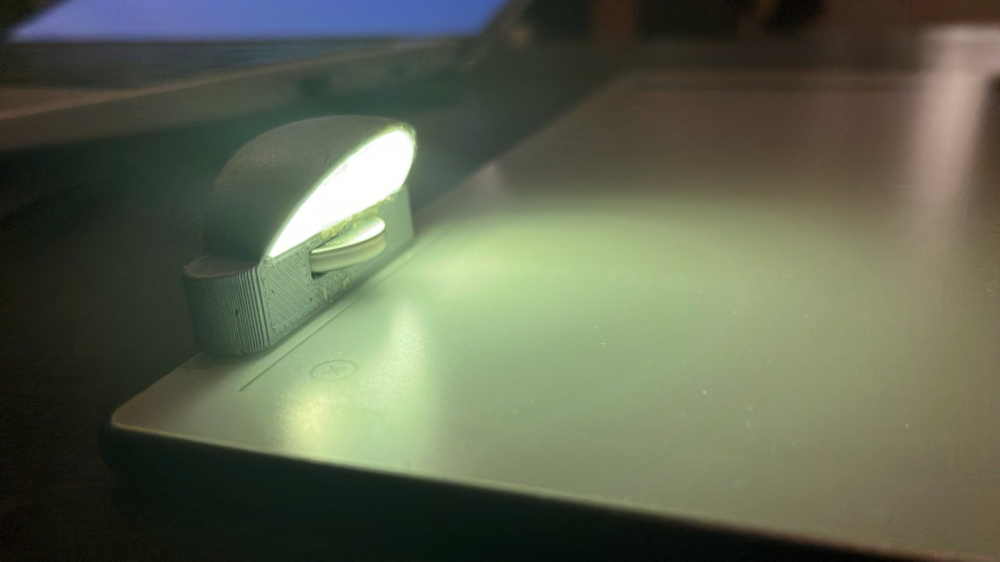
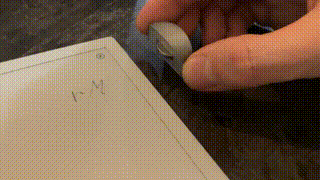
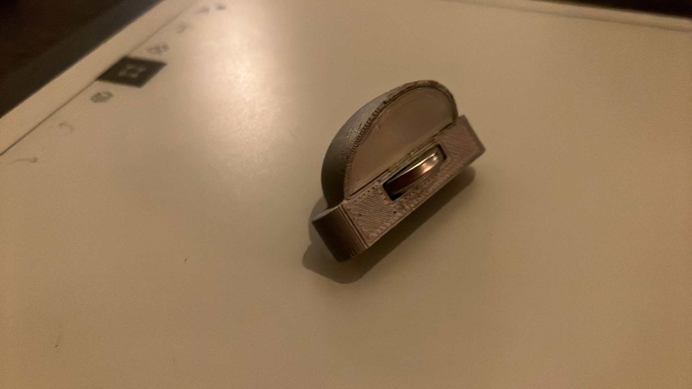
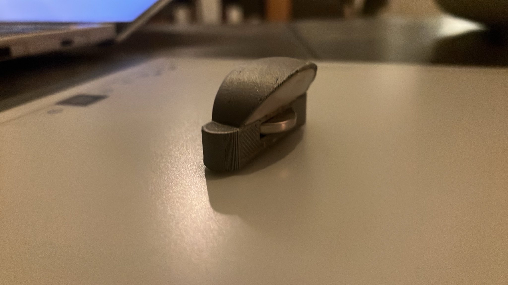
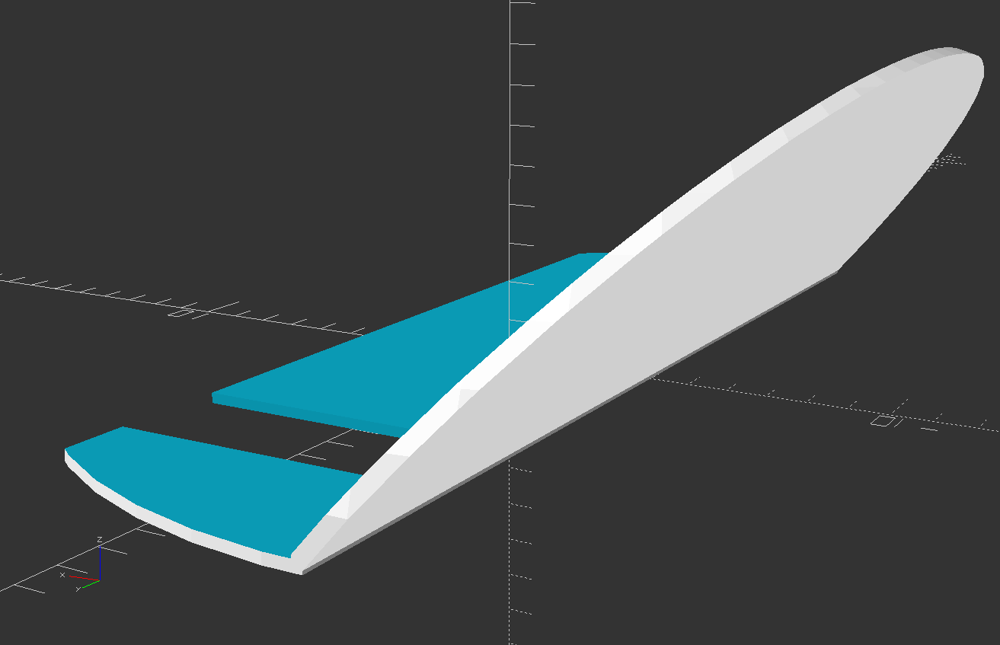
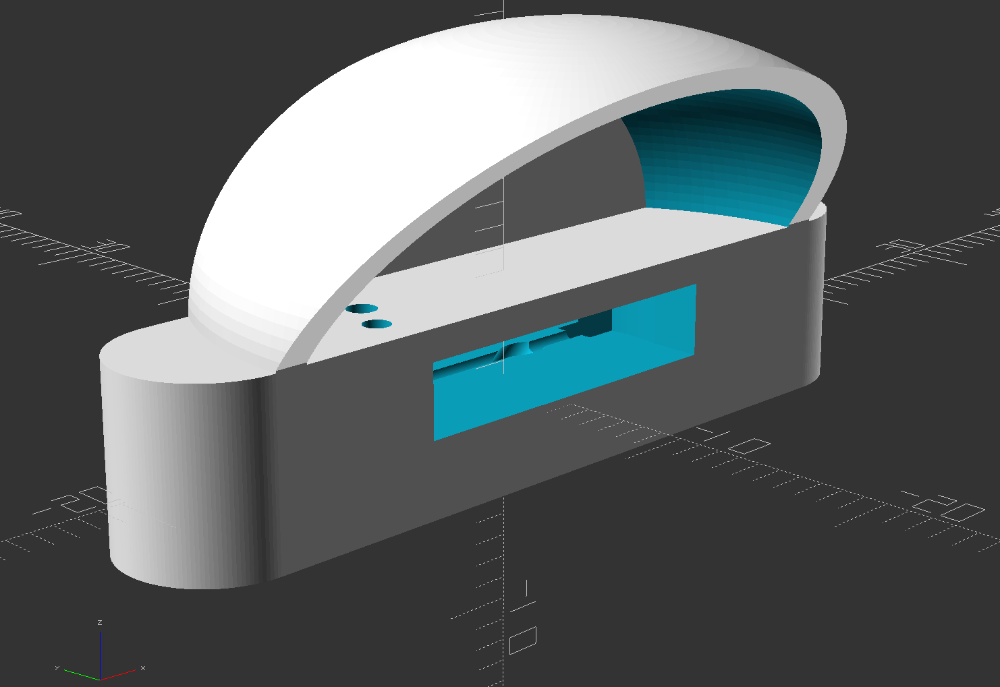

# rM2 reading light

A small reading light that attaches to the magnets in the upper right of the reMarkable 2 tablet.
The reed-switch in the bottom activates the light when its in place.
No soldering, all parts are press fit. Although the diffuser is best glued in place.

**Parts list**:
- CR1632/LIR1632 battery
- Led with 6mm diameter, 9mm length
- reed-switch with 3.4mm diameter, 14mm length
- some aluminum foil (as reflector for the led)
- patience (the glass reed-switches break a lot)

## Pics
|                         |                                          |
|-------------------------|------------------------------------------|
|  |  |
|  |                   |
|    |                |